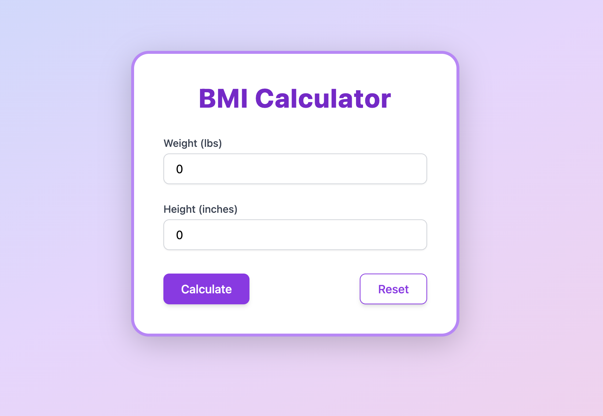

# 🧮 BMI Calculator

A beautiful, modern Body Mass Index (BMI) calculator built with **React**, **Vite**, and **Tailwind CSS**. Instantly check your BMI and get health feedback in a delightful UI!

[](https://new-bmi-alpha.vercel.app/)

---

## ✨ Features

- 🎨 **Modern, responsive design**
- ⚡ **Instant BMI calculation**
- 🟢 **Health feedback** (underweight, healthy, overweight, obese)
- 🌈 **Animated gradients & smooth UI**
- 🔄 **Reset with one click**
- 🛠️ Built with React, Vite, and Tailwind CSS

---

## 📸 Screenshot



---

## 🚀 Live Demo

👉 [Try it now!](https://new-bmi-alpha.vercel.app/)

---

## 🛠️ Getting Started

### 1. Clone the repository

```bash
git clone https://github.com/chiyaw/new-bmi.git
cd new-bmi
```

### 2. Install dependencies

```bash
npm install
```

### 3. Start the development server

```bash
npm run dev
```

The app will be available at [http://localhost:5173](http://localhost:5173) (or as indicated in your terminal).

---

## 🧑‍💻 Tech Stack

- [React](https://react.dev/) 19+
- [Vite](https://vitejs.dev/)
- [Tailwind CSS](https://tailwindcss.com/)

---

## 🤔 How It Works

1. **Enter your weight** (in pounds)
2. **Enter your height** (in inches)
3. Click **Calculate**
4. Instantly see your BMI and a health message
5. Use **Reset** to clear the form

---

## 🙌 Contributing

Pull requests are welcome! For major changes, please open an issue first to discuss what you would like to change.

